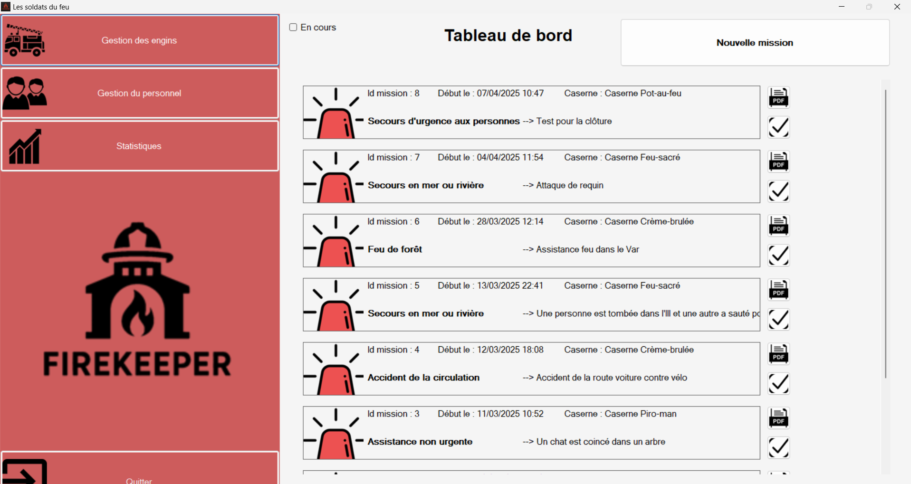
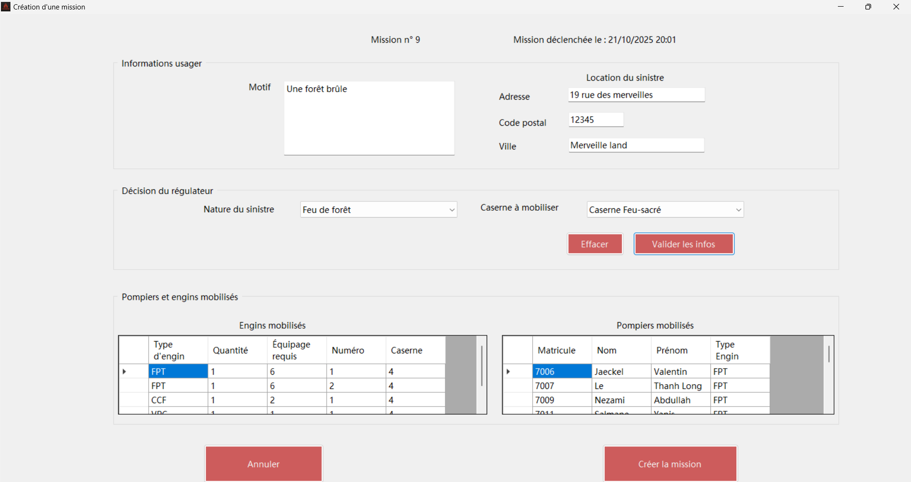
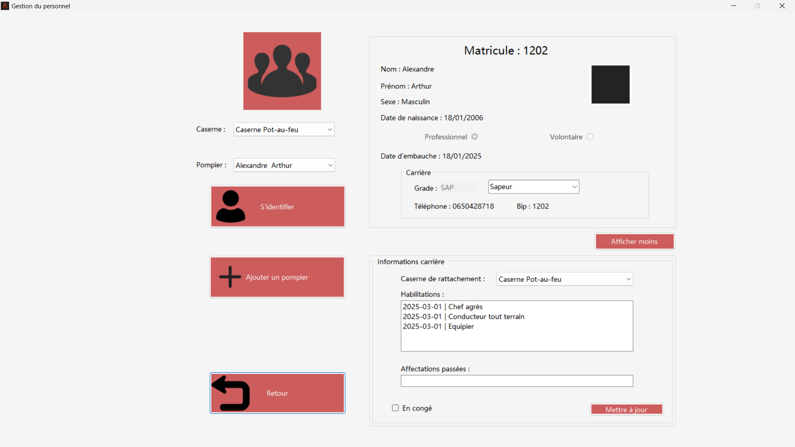

# Gestion Caserne Pompier 🚒  
[English version below](#english-version)

Application de gestion d’une caserne de pompiers développée en C# : suivi du personnel, des véhicules et des interventions.

---

## 👥 Contributeurs
| Nom | GitHub |
|-----|--------|
| Arthur ALEXANDRE | [@ArthurALEXANDRE-29](https://github.com/ArthurALEXANDRE-29) |
| Andy PHAN | [@cestlelheure](https://github.com/cestlelheure) |
| Adrien THIERRY |

---

## 🖼️ Aperçu

| Tableau de bord | Intervention | Gestion pompier |
|-----------------|-------------|-----------------|
|  |  |  |

---

## ✨ Fonctionnalités (résumé)
- Gestion du personnel (ajout / modification / suppression, grades, congés)
- Gestion des véhicules
- Enregistrement / clôture d’interventions (missions)
- Recherche & historique
- Authentification / rôles (si activé)
- Tableau de bord (FormTableauDeBord)
- Statistiques

---

## 🚀 Installation & Lancement (Version Simplifiée)

1. Cloner le projet  
   ```bash
   git clone https://github.com/ArthurALEXANDRE-29/gestion-caserne-pompier.git
   ```
2. Ouvrir la solution dans Visual Studio 2022 :  
   Fichier > Ouvrir > Projet/Solution > `Caserne/Caserne.sln`  
3. Restaurer les packages NuGet :  
   - Clic droit sur la solution → « Restaurer les packages NuGet »  
4. Lancer l’application (projet WinForms) et exécuter la fenêtre principale : `FormTableauDeBord`.

Packages utilisés (à restaurer via NuGet) :  
- System.Data.SQLite.Core  
- iTextSharp  
- BouncyCastle.Cryptography  
- (Ajouter d’autres ici si nécessaire)

> Erreur `Stub.System.Data.SQLite.Core.NetFramework` : relancer une restauration des packages; si besoin migrer vers `PackageReference`.

---

## 📁 Structure (simplifiée)
```
.
├── README.md
├── .gitignore
└── Caserne/
    ├── Caserne.sln
    ├── SDIS67.db
    ├── packages/
    ├── CompteRendus_ExplicationCode/
    ├── Caserne/
    │   ├── Caserne.csproj
    │   ├── Program.cs
    │   ├── FormTableauDeBord.cs
    │   ├── FormTableauDeBord.Designer.cs
    │   ├── FormTableauDeBord.resx
    │   ├── (autres Form*.cs / *.Designer.cs / *.resx)
    │   ├── Properties/
    │   ├── Resources/
    │   ├── Assets/
    │   │   ├── tableauBord.png
    │   │   ├── CreationMission.png
    │   │   └── GestionPompier.png
    │   ├── bin/    (ignoré)
    │   └── obj/    (ignoré)
    └── .vs/        (ignoré)
```

---

## 📋 Cahier des charges (avancement)
| Élément | Statut |
|---------|--------|
| Gestion personnel | ✔️ |
| Gestion véhicules | ✔️ |
| Gestion interventions | ✔️ |
| Authentification | ✔️ |
| Tableau de bord | ✔️ |
| Historique / recherche | ✔️ |
| PDF / exports | ✔️ |
| Tests | ✔️ |

---

## 📝 Licence
Projet académique (Université de Strasbourg) – usage pédagogique.

---

# English Version

## Overview
Fire station management application (C#, WinForms, SQLite) handling staff, vehicles, missions (incidents), history, dashboard and statistics.

---

## 👥 Contributors
| Name | GitHub |
|------|--------|
| Arthur ALEXANDRE | [@ArthurALEXANDRE-29](https://github.com/ArthurALEXANDRE-29) |
| Andy PHAN | [@cestlelheure](https://github.com/cestlelheure) |
| Adrien THIERRY |  |

---

## 🖼️ Screenshots

| Dashboard | Mission Creation | Firefighter Management |
|-----------|------------------|------------------------|
|  |  |  |

---

## ✨ Features (summary)
- Staff management (add / edit / delete, ranks, leave)
- Vehicle management
- Mission / incident recording & closing
- Search & history
- Authentication / roles (if enabled)
- Main dashboard (`FormTableauDeBord`)
- Statistics

---

## 🚀 Quick Setup
1. Clone repository  
   ```bash
   git clone https://github.com/ArthurALEXANDRE-29/gestion-caserne-pompier.git
   ```
2. Open the solution in Visual Studio 2022: `Caserne/Caserne.sln`  
3. Restore NuGet packages (Solution right‑click → Restore NuGet Packages)  
4. Run the WinForms project and start `FormTableauDeBord`.

NuGet packages in use:
- System.Data.SQLite.Core
- iTextSharp
- BouncyCastle.Cryptography
- (Add others if needed)

> If you encounter `Stub.System.Data.SQLite.Core.NetFramework` error: restore packages again or migrate to `PackageReference`.

---

## 📁 Structure (simplified)
```
Repository root
├── README.md
├── .gitignore
└── Caserne/
    ├── Caserne.sln
    ├── SDIS67.db
    ├── packages/
    ├── CompteRendus_ExplicationCode/
    ├── Caserne/
    │   ├── *.cs / *.Designer.cs / *.resx
    │   ├── Properties/
    │   ├── Resources/
    │   ├── Assets/
    │   │   ├── tableauBord.png
    │   │   ├── CreationMission.png
    │   │   └── GestionPompier.png
    │   ├── bin/
    │   └── obj/
    └── .vs/
```

---

## 📋 Requirements Progress
| Item | Status |
|------|--------|
| Staff management | ✔️ |
| Vehicle management | ✔️ |
| Mission / incident management | ✔️ |
| Authentication | ✔️ |
| Dashboard | ✔️ |
| History / search | ✔️ |
| PDF / exports | ✔️ |
| Tests | ✔️ |

---

## 📝 License
Academic project (University of Strasbourg) – educational use.

---
